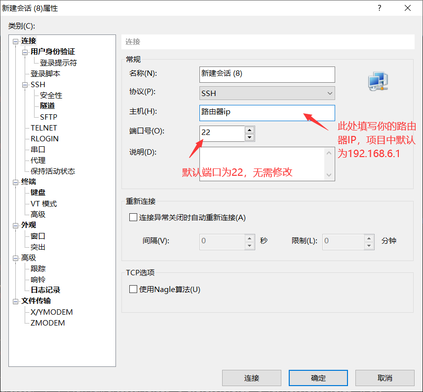
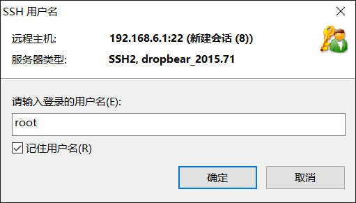
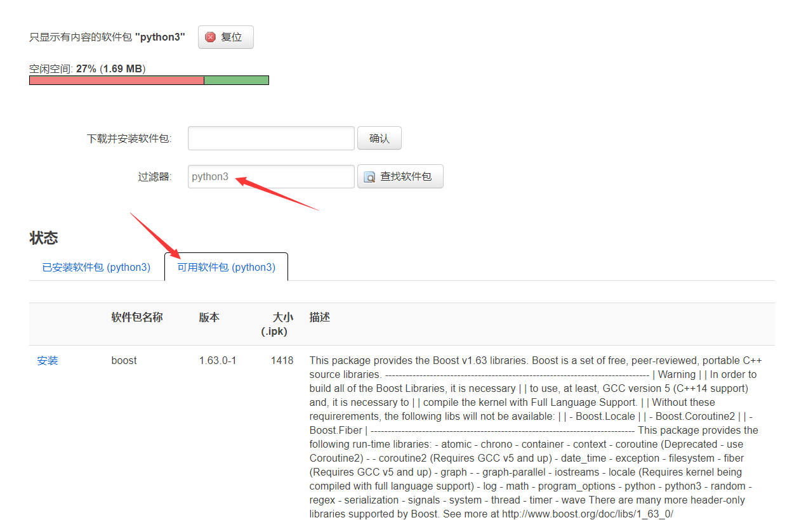
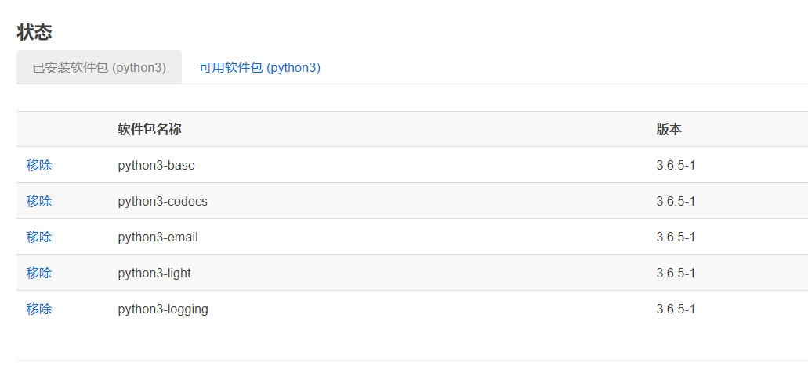
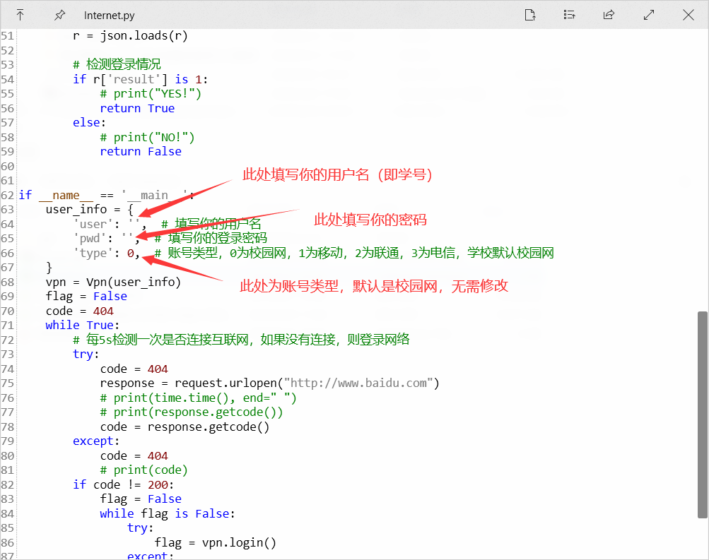
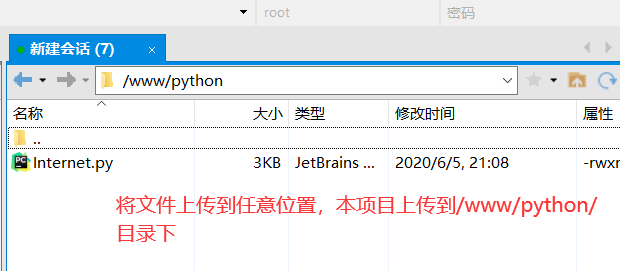
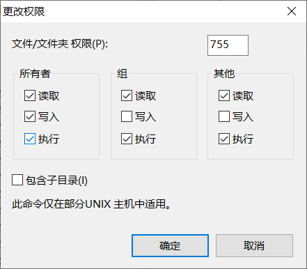
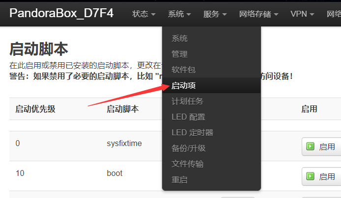

# QUT校园网之路由器自动登录教程

**该教程需要对路由器刷机，刷机有风险，动手需谨慎**

## 本项目参考自 [矿大哆点网络路由器自动登陆教程](https://github.com/cumtiotlib/cumtddnet)

## 简述

自QUT校园网改造以来，本人的树莓派、打印机等设备就无法联网使用，为了解决这一痛点，故做此教程，以实现在路由器上自动登录校园网。

本项目中，主要有以下功能

1. 启动路由器时自动登录校园网
2. 实时监测校园网情况，若校园网掉线，实现重新登录

本教程中使用的路由器为斐讯K2P。

## 工具

1. 斐讯K2P
2. Xshell6
3. Xftp6

## 第一步 路由器刷机

首先，需要对路由器进行刷机，将路由器系统刷成PandoraBox或OpenWrt等系统。

具体刷机步骤本处不再赘述，请参考该篇帖子。https://www.right.com.cn/forum/thread-546812-1-1.html

该文章中使用的工具为本仓库中`breed.zip`文件。

若使用的K2P路由器官方系统版本过低，则会刷机失败。此时，请下载本仓库中`K2P_V22.8.5.189.bin`文件，对官方系统进行手动升级后再进行刷机。

在本教程中，使用的路由器系统为`PandoraBox-ralink-mt7621-k2p-19.02-V1.6.0-squashfs-sysupgrade.bin`，该系统由恩山无线论坛大佬提供。系统链接：https://www.right.com.cn/forum/forum.php?mod=viewthread&tid=2758954&extra=page%3D2%26filter%3Dtypeid%26typeid%3D14

## 第二步 设置路由器后台

### 1. 登录路由器

首先，我们需要登录路由器后台。

路由器的后台地址由各固件编译者自行设置。一般为192.168.1.1等常用地址。

本仓库提供的固件后台地址为192.168.6.1，用户名为root，默认密码为admin


### 2. 连接互联网

该步的主要作用是用于可以联网安装后续需要的各软件等。

在进入后台后，选择网络中的`无线`选项，进入如下界面。（本人使用的是无线校园网，情况允许，也可使用有线网络）


点击`扫描`按钮，扫描存在的无线网络，找到最近的校园网络后，点击加入，使用默认配置，直接提交即可。


在等待一段时间后，可以看到路由器已经获取到IP地址。

此时，登录`10.20.10.11`，进行身份认证。

### 3. 登录路由器后台

由于需要对路由器系统进行设置，需要进入路由器后台。

使用Xshell 6连接路由器。

直接选择 文件->新建，在主机中填入默认的路由器地址，点击连接。



此时会弹出对话框，选择保存密钥。

之后按照提示，依次填入用户名、密码等，最终登录路由器后台。




### 4. 设置SFTP

由于我们需要将文件上传到路由器，为了简便，我们可以开启sftp。

在命令行下，依次输入如下指令

```
opkg update
opkg install vsftpd openssh-sftp-server
/etc/init.d/vsftpd enable
/etc/init.d/vsftpd start
```

这样便可以开启sftp。

### 第三步 安装python环境

本项目是使用python3开发的，故需要在路由器中安装python3环境。

在进入路由器管理界面后，点击系统下`软件包`选项。


在过滤器中输入`python3`，点击查找。



在可用软件包中找到如下几个包进行安装。它们将问执行python提供必要的环境。



需要注意的是，由于需要安装许多包，故在选择路由器固件时必须谨慎，至少要为环境留下5M左右的空间。

### 第四步 上传文件

打开XFTP 6，连接路由器后台。

先打开`Internet.py`文件，将`user`、`pwd`字段修改成你的用户名和密码，然后保存。



将`Internet.py`文件上传路由器后台。

本项目中，该文件被上传到`/www/python`目录下。



然后对目录授予执行权限。



### 第五步 设置运行

进入路由器管理界面，选择系统下的`启动项`选项。



在本地启动脚本中填入如下代码

```
python3 /www/python/Internet.py &
```

该句需要添加在`exit(0)`之前，具体的文件路径按照你上传的路径填写。


然后选择提交。

### 收尾

在完成上述操作后，重启路由器。

在正常情况下，在等待路由器初始化完成后，已经可以实现自动登录校园网了。


## Q/A

1. 是否一定要使用项目中提供的系统、路由器？

   不需要，只要是Linux平台下的系统即可。使用者可以前往恩山无线论坛，找到自己的路由器板块，选择自己喜爱的固件即可。

2. 在启动路由器后没有实现自动登录？

   该种情况发生原因暂不明确，建议重启路由器基本上就可以解决。出现概率较低。怀疑是由于内存不足系统自动将进程kill掉了。

3. 在重启路由器后无法登录管理界面？

   请检查设置运行时，启动脚本填入的代码最后是否添加“&”字符，若缺少该字符极易发生这种情况。